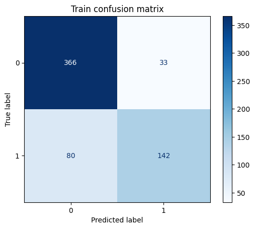
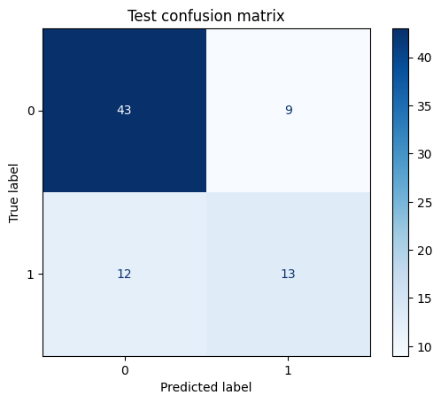
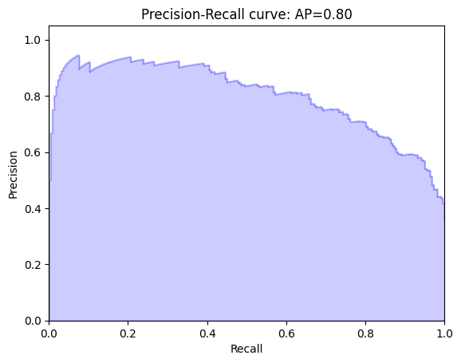
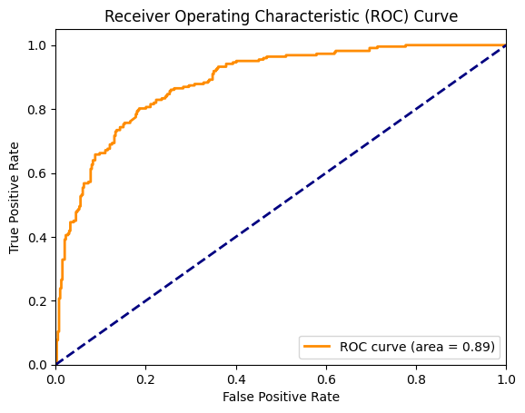
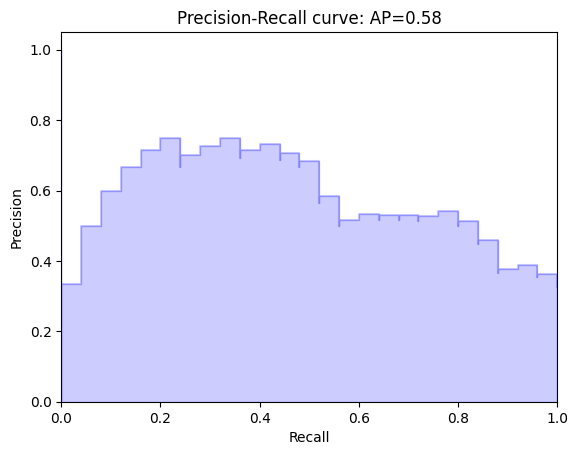
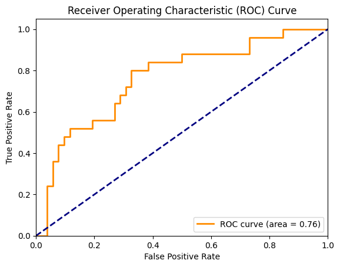
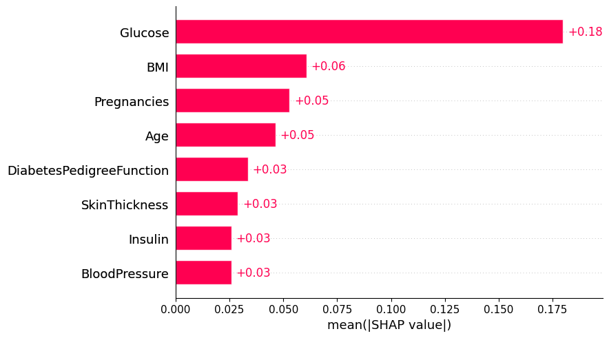
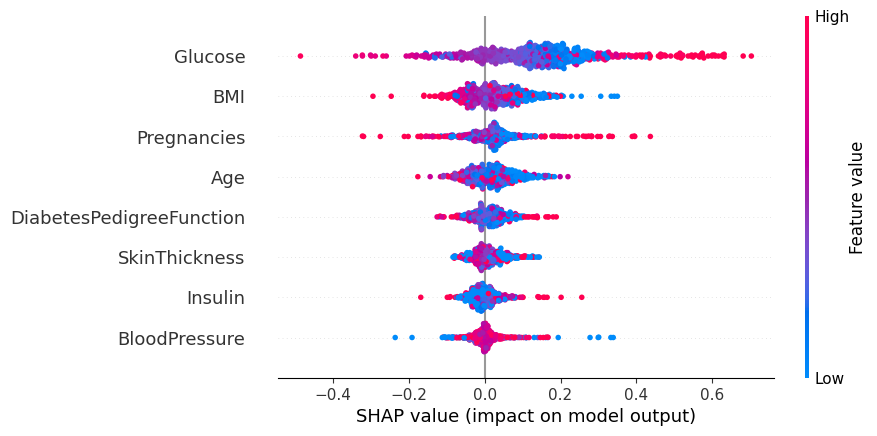

# 🔬 Interpretable Diabetes Prediction Using Neural Networks, Grid Search, and SHAP

This project builds a robust and interpretable deep learning model for **diabetes prediction** using medical features. It combines the power of a **Neural Network**, **Grid Search CV** for hyperparameter tuning, and **SHAP** for model explainability.

---


## 📊 Dataset

We use the **Pima Indians Diabetes Dataset** consisting of diagnostic measurements from female patients.

**Features:**
- Pregnancies
- Glucose
- Blood Pressure
- Skin Thickness
- Insulin
- BMI
- Diabetes Pedigree Function
- Age

📁 [Dataset Source](https://www.kaggle.com/uciml/pima-indians-diabetes-database)

---

## 🧠 Model Architecture

- Framework: `PyTorch` (via `skorch` wrapper)
- Model: Fully-connected Feedforward Neural Network
- Activation: ReLU
- Output Layer: Sigmoid or Softmax (binary classification)
- Optimizer: Adam
- Loss: CrossEntropyLoss

---

📂 Folder Structure
----------------------
```
Interpretable-diabetes-prediction/
│           
├── Dataset/                   
│   └── diabetes.csv
├── Figure/                    
├── README.md                     
└── Train_Test_model.ipynb     
```

## 🔍 Hyperparameter Tuning with Grid Search CV

We apply **`GridSearchCV`** from `sklearn` with `skorch.NeuralNetClassifier` to find optimal hyperparameters.

### 🔧 Parameters tuned:

```python
param_grid = {
    'optimizer': [
            torch.optim.SGD,
            torch.optim.Adagrad,
            torch.optim.Adadelta,
            torch.optim.Adam,
            torch.optim.Adamax
        ],
    'optimizer__lr': [0.001, 0.01, 0.1],
    'max_epochs': [100, 500, 1000],
    'batch_size': [20, 40, 80, 100],
    'module__init_mode': ['he_uniform'],
    'module__activation': [F.relu],
    'module__dropout_rate': [0.2, 0.3, 0.5],
    'module__neuron_number': [5, 10, 30, 60]
}
```

## 🔍 Results 
### 📈 Model Evaluation: Confusion Matrices
We evaluate the performance of the neural network using two different models or scenarios. The following confusion matrices show the performance of each model on the test set.

Confusion Matrix for Train dataset and test dataset (e.g., Neural Network with Grid Search)




### 📈 PR-AUC and ROC-AUC for train set



### 📈 PR-AUC and ROC-AUC for test set



## 🧠 Model Explainability (SHAP)
To ensure transparency, we used SHAP (SHapley Additive exPlanations) to visualize and interpret the model's behavior.

- Understand global feature importance
- Visualize individual prediction contributions
- Detect model biases and interactions
- How individual features impact each prediction
- Global importance of features across the dataset
- Visualization of feature effects and interactions
🔍 SHAP Summary Plot

**Mean contribution features** 



**Global value of each features** 



Features like **Glucose, BMI, and Pregnancies** had the highest impact on predictions.


### ▶️ Usage

jupyter notebook notebooks/Train_Test_model.ipynb


### 📦 Requirements
Key libraries used:
- numpy
- pandas
- matplotlib / seaborn
- scikit-learn
- skorch
- torch
- shap
- jupyter


### 🚀 Future Work Integrate early stopping and dropout for regularization

- Try other interpretable models like Decision Trees or Explainable Boosting Machines (EBMs)
- Extend dataset with synthetic features or time-series inputs
- Deploy model as a simple web API or streamlit dashboard

